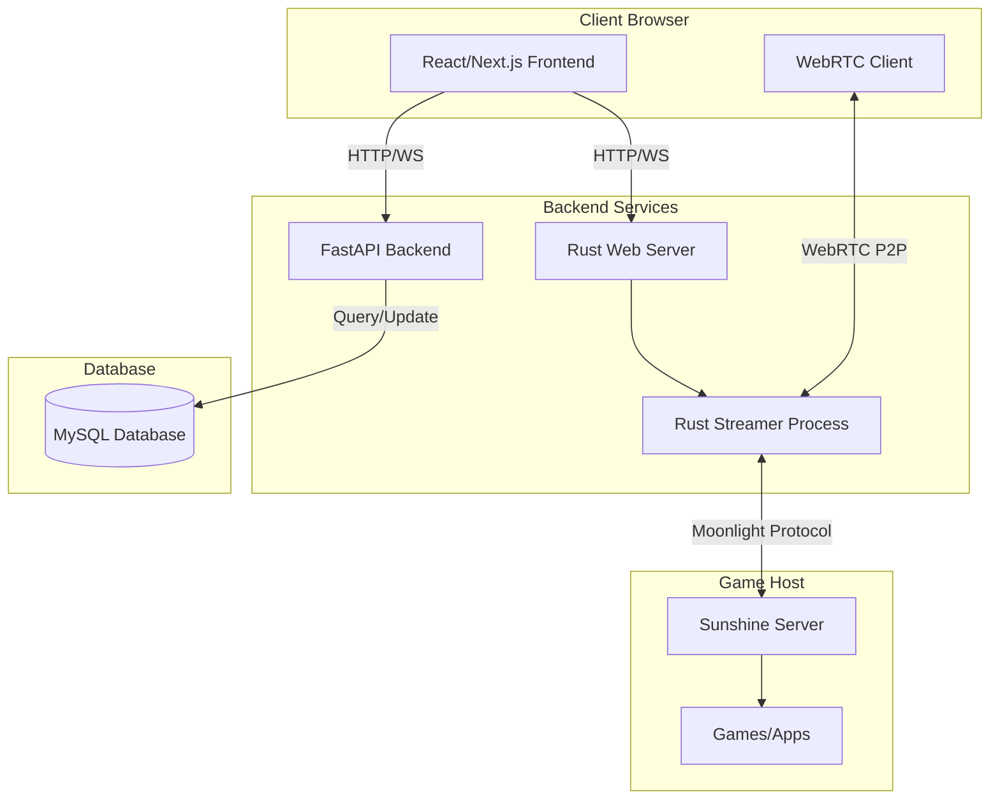

# Game Cloud Gaming

Nền tảng Game Streaming trên nền web cho phép người dùng stream và chơi game từ xa thông qua trình duyệt.

## Mục lục

- [Luồng hoạt động](#luồng-hoạt-động)
- [Hình ảnh Demo](#hình-ảnh-demo)
- [Công nghệ sử dụng](#công-nghệ-sử-dụng)
- [Cài đặt](#cài-đặt)
- [Giấy phép](#giấy-phép)

## Luồng hoạt động

### 1. Đăng ký / Đăng nhập
- Người dùng truy cập vào web frontend
- Đăng ký tài khoản mới hoặc đăng nhập bằng tài khoản có sẵn
- Backend xác thực thông tin và tạo JWT token (access token + refresh token)
- Token được lưu trữ để sử dụng cho các request tiếp theo

### 2. Quản lý Host (Máy chủ game)
- Người dùng thêm máy chủ game (host) mới bằng cách nhập địa chỉ IP và cổng
- Hệ thống kết nối với Sunshine server chạy trên máy chủ game
- Thực hiện pairing (ghép nối) giữa client và server bằng mã PIN
- Lưu trữ thông tin host vào database

### 3. Xem danh sách game
- Frontend gọi API để lấy danh sách các ứng dụng/game có sẵn trên host
- Backend kết nối với Sunshine server để lấy thông tin các game đã cấu hình
- Hiển thị danh sách game với hình ảnh và thông tin chi tiết

### 4. Streaming game
- Người dùng chọn game muốn chơi
- Frontend khởi tạo kết nối WebRTC với streamer
- Streamer subprocess được khởi động để xử lý stream từ Sunshine
- Thiết lập peer-to-peer connection giữa browser và host máy chủ
- Video/Audio stream được truyền qua WebRTC
- Input từ bàn phím/chuột/gamepad được gửi ngược lại host

### 5. Kiến trúc hệ thống



### Luồng dữ liệu chi tiết:

1. **Authentication Flow**:
   - Client → FastAPI: Đăng nhập/Đăng ký
   - FastAPI → Database: Xác thực user
   - FastAPI → Client: Trả về JWT tokens

2. **Host Management Flow**:
   - Client → FastAPI: Thêm/Xóa/Sửa host
   - FastAPI → Database: Lưu thông tin host
   - Rust Web Server → Sunshine: Pairing và discovery

3. **Streaming Flow**:
   - Client → Rust Web Server: Request stream
   - Web Server → Streamer Process: Spawn subprocess
   - Streamer → Sunshine: Kết nối Moonlight protocol
   - Client ↔ Streamer: WebRTC peer connection
   - Sunshine → Games: Launch và streaming

## Hình ảnh Demo

<!-- Placeholder cho hình ảnh - sẽ được thêm vào sau -->

### Giao diện đăng nhập


### Danh sách Host


### Danh sách Game


### Màn hình Streaming


## Công nghệ sử dụng

### Frontend
- **Next.js 16** - React framework cho server-side rendering
- **React 19** - Thư viện UI component
- **Material-UI (MUI)** - Component library và design system
- **TypeScript** - Type-safe JavaScript
- **Zustand** - State management
- **Axios** - HTTP client

### Backend API
- **FastAPI** - Modern Python web framework
- **SQLAlchemy** - ORM cho database
- **PyMySQL** - MySQL database connector
- **Pydantic** - Data validation
- **Python-JOSE** - JWT token handling
- **Passlib + Bcrypt** - Password hashing
- **Uvicorn** - ASGI server

### Streaming Server
- **Rust** - Systems programming language
- **Actix-Web** - Web framework cho Rust
- **WebRTC** - Real-time communication
- **Moonlight Protocol** - Game streaming protocol
- **Tokio** - Async runtime cho Rust
- **Serde** - Serialization/Deserialization

### Database
- **MySQL** - Relational database

### Game Host
- **Sunshine** - Game streaming server (fork của NVIDIA GameStream)
- **Moonlight Common C** - Core library cho Moonlight protocol

### DevOps & Tools
- **Docker** - Containerization
- **Cargo** - Rust package manager
- **npm** - Node.js package manager
- **CMake** - Build system
- **Cross** - Rust cross-compilation

### Protocols & Standards
- **WebRTC** - Peer-to-peer streaming
- **WebSocket** - Real-time bidirectional communication
- **HTTPS/TLS** - Secure communication
- **STUN/TURN** - NAT traversal
- **JWT** - Authentication tokens

## Cài đặt

### Yêu cầu hệ thống
- Node.js 20+ và npm
- Python 3.8+
- Rust (nightly)
- MySQL Database
- Sunshine Server (cài trên máy host game)

### Cài đặt Frontend

```bash
cd moonlight-web/nextjs-frontend
npm install
npm run dev
# Hoặc sử dụng script
cd ../..
./start-frontend.sh
```

### Cài đặt Backend Python

```bash
cd backend-python
python3 -m venv venv
source venv/bin/activate  # Trên Windows: venv\Scripts\activate
pip install -r requirements.txt

# Cấu hình database trong .env file
# Chạy server
uvicorn apps.main:app --reload --port 8000
# Hoặc sử dụng script
cd ..
./start-backend-python.sh
```

### Cài đặt Rust Streaming Server

```bash
# Build project
cargo build --release

# Chạy web server
./target/release/web-server
```

### Cấu hình

1. **Database**: Tạo database MySQL và cập nhật thông tin kết nối trong `backend-python/.env`
2. **Sunshine**: Cài đặt và cấu hình Sunshine trên máy host game
3. **CORS**: Cấu hình allowed origins trong `backend-python/apps/main.py`
4. **WebRTC**: Cấu hình ICE servers và port range trong `server/config.json`

## Giấy phép

GPL-3.0-or-later

---

